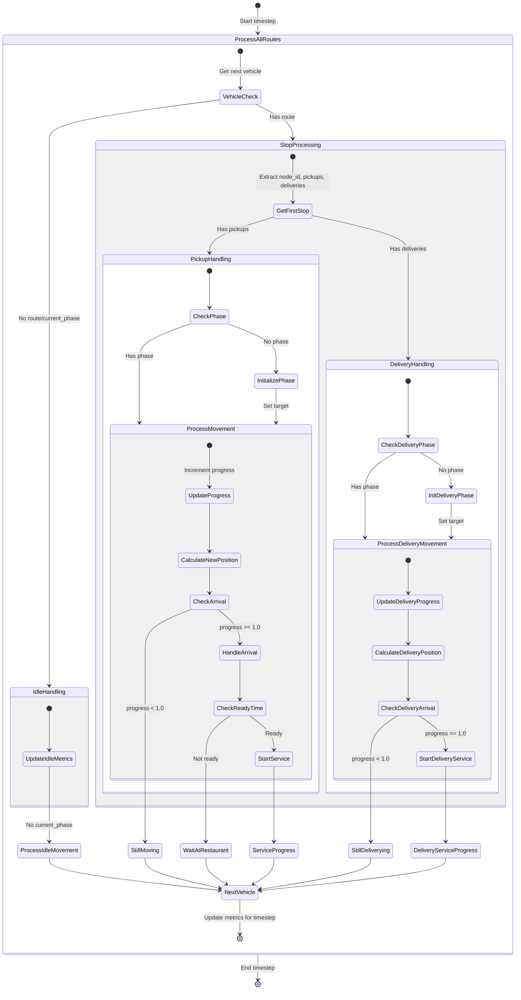

<!-- Press Ctrl+Shift+V for preview -->

# Route Processing Flow
 
## Process all routes:




## Process a single order

``` mermaid

stateDiagram-v2
    [*] --> ValidateOrder: Initialize & get order
    ValidateOrder --> [*]: Order not found
    
    ValidateOrder --> CheckRerouting: Order found
    
    state CheckRerouting {
        [*] --> ReroutingCheck: Check if rerouting needed
        ReroutingCheck --> ResetPhase: Different order in pickup
        ResetPhase --> InitPhase: Reset & make order pending
        ReroutingCheck --> InitPhase: No rerouting needed
    }
    
    state ProcessPhase {
        InitPhase --> CheckService: Initialize phase if needed
        CheckService --> ServiceHandling: Is servicing
        CheckService --> MovementHandling: Not servicing
        
        state ServiceHandling {
            [*] --> ProcessService
            ProcessService --> CompleteService: Service done
            ProcessService --> ContinueService: Service ongoing
        }
        
        state MovementHandling {
            [*] --> UpdateProgress: Handle movement
            UpdateProgress --> CalculateNewPosition
            CalculateNewPosition --> CheckArrival: Check arrival
            CheckArrival --> HandleArrival: progress >= 1.0
            CheckArrival --> ContinueMovement: progress < 1.0
        }
    }
    
    ServiceHandling --> ReturnState
    MovementHandling --> ReturnState
    
    state ReturnState {
        [*] --> ReturnValues: Return appropriate values
        ReturnValues --> CompleteReturn: (new_loc, distance, delay, completed)
    }
    
    ReturnState --> [*]

 ```