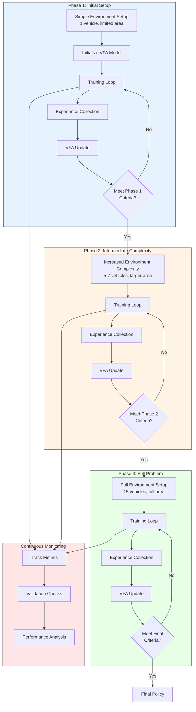

<!-- Press Ctrl+Shift+V for preview -->
# Training Process 

```mermaid

flowchart TD
    subgraph Initial ["Phase 1: Initial Setup"]
        A[Simple Environment Setup<br/>1 vehicle, limited area] --> B[Initialize VFA Model]
        B --> C[Training Loop]
        C --> D[Experience Collection]
        D --> E[VFA Update]
        E --> F{Meet Phase 1<br/>Criteria?}
        F -->|No| C
    end

    subgraph Intermediate ["Phase 2: Intermediate Complexity"]
        G[Increased Environment Complexity<br/>5-7 vehicles, larger area] --> H[Training Loop]
        H --> I[Experience Collection]
        I --> J[VFA Update]
        J --> K{Meet Phase 2<br/>Criteria?}
        K -->|No| H
    end

    subgraph Full ["Phase 3: Full Problem"]
        L[Full Environment Setup<br/>15 vehicles, full area] --> M[Training Loop]
        M --> N[Experience Collection]
        N --> O[VFA Update]
        O --> P{Meet Final<br/>Criteria?}
        P -->|No| M
    end

    subgraph Monitoring ["Continuous Monitoring"]
        Q[Track Metrics]
        R[Validation Checks]
        S[Performance Analysis]
    end

    F -->|Yes| G
    K -->|Yes| L
    P -->|Yes| T[Final Policy]

    C --> Q
    H --> Q
    M --> Q
    Q --> R
    R --> S

    style Initial fill:#e6f3ff,stroke:#4a4a4a
    style Intermediate fill:#fff3e6,stroke:#4a4a4a
    style Full fill:#e6ffe6,stroke:#4a4a4a
    style Monitoring fill:#ffe6e6,stroke:#4a4a4a

```